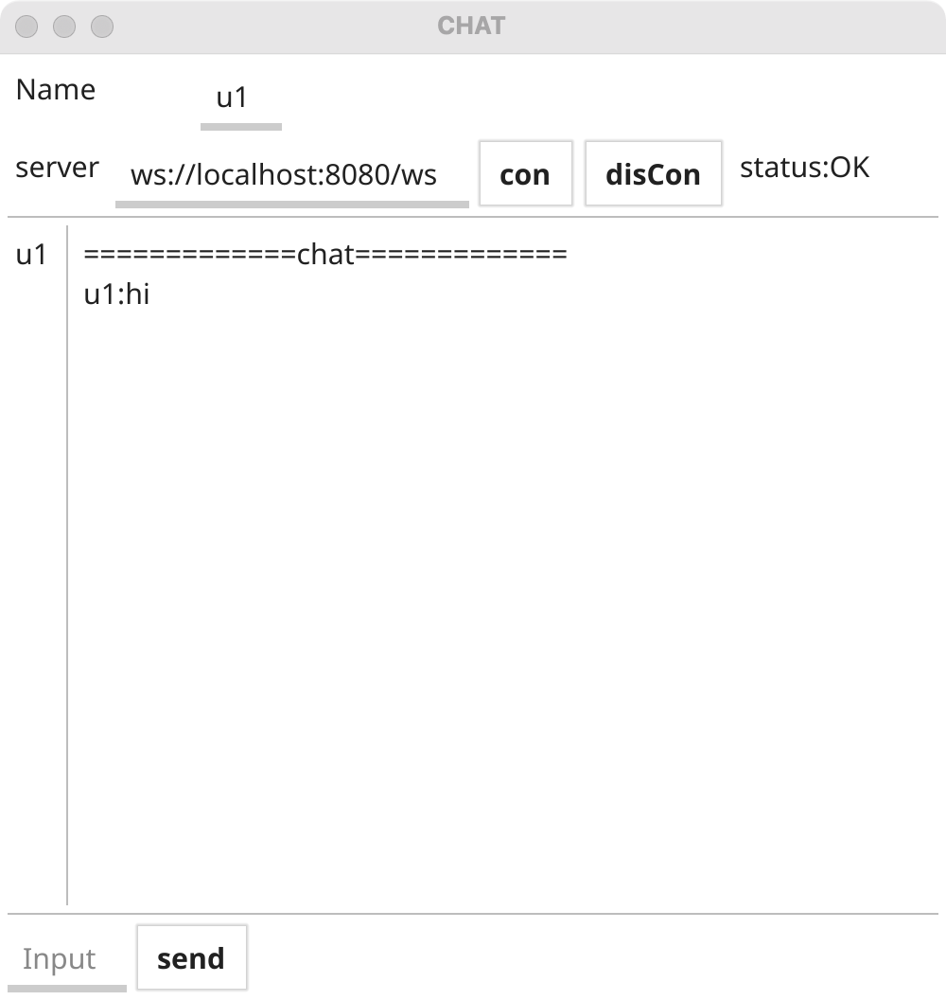

#使用fyne开发聊天客户端

#整体框架
```
运用fyne 完成gui设计 
```


```
├── README.md               #介绍
├── go.mod
├── handle                  #处理router的请求
│   └── handle.go
├── log                     #日志文件夹
│   └── info.log
├── main.go                 #代码入口
├── module                  #数据模型
│   ├── const.go      #const数据
│   └── handleChan.go 
├── protobuf                #proto文件夹
│   ├── com.pb.go
│   └── com.proto
├── router                  #路由
│   └── router.go
└── view                    #界面显示文件 夹
    └── view.go

```
#运行方式

```
go run main.go
```
#运行截图


