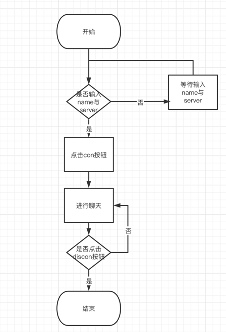
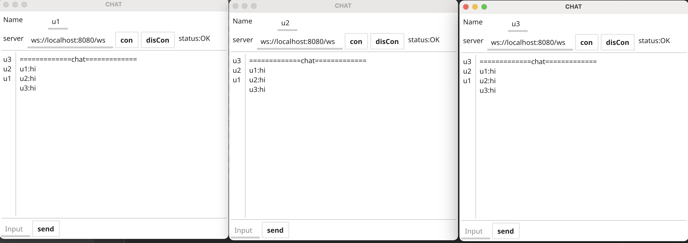
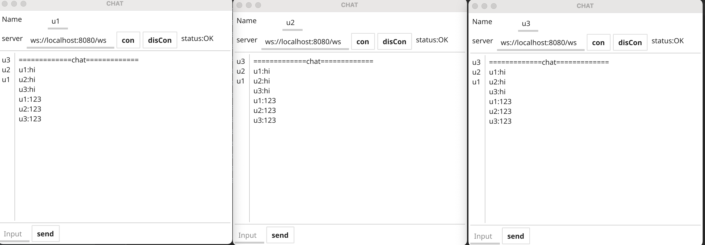
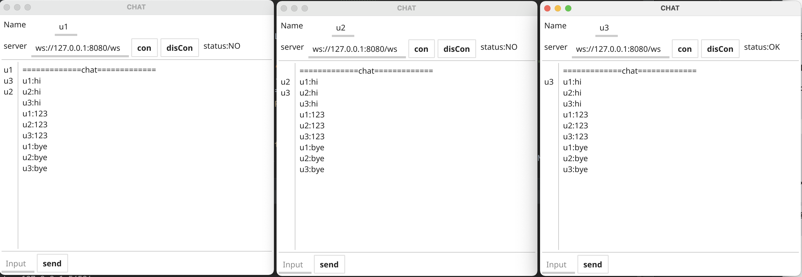

#使用fyne开发聊天客户端

#整体框架
```
运用fyne 完成gui设计,开发一个聊天客户端。
```

#目录结构
```
├── README.md               #介绍
├── go.mod
├── controller              #处理view转发的数据
│   └── controller.go
├── log                     #日志文件夹
│   └── info.log
├── main.go                 #代码入口
├── module                  #数据模型
│   ├── const.go            #const数据
│   └── handleChan.go 
│   └── viewModule.go       
├   └── protobuf            #proto文件夹
│     ├── com.pb.go
│     └── com.proto
└── view                    #界面显示文件夹
    └── view.go

```


#代码逻辑分层
| 层     | 文件夹  |主要职责 |调用关系|
| :----: | :---- |:-----  | :-----|
|view    | /view |界面展示   |调用controller |
|controller | /controller|处理界面的数据，并将处理后的数据发送回view|调用module|
|module  | /module|数据模型 | 被controller调用|

#存储设计

##HandleChan
| 内容 | 类型 |  说明 |
| :----:| :---- | :----|
|UserListChan|chan int|用于发送用户列表的chan|
|UserChatChan |chan int|用于发送聊天信息的chan|
|UserListMsg |string|发送用户列表信息|
|UserChatMsg |string|发送聊天信息|

#运行方式

```
go run main.go
```

#使用方法
```
运行后，输入username 与 server（ws://localhost:8080/ws)后 点击con按钮 状态显示为OK后 
即可在下面的输入框输入信息，点击发送即可完成发送。
```
#运行截图


#第三方库
```
google.golang.org/protobuf      通信数据的传输格式 protobuf
fyne.io/fyne                    GUI界面的设计与实现
```

#流程图    


#测试截图



